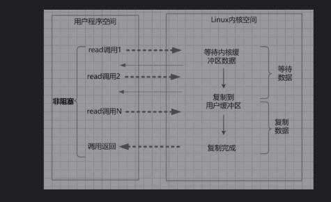

# NioDemo
java NIO学习

网络IO的过程：

1. 等待数据从网络中到达网卡，当所有分组到达后它将会被复制到内核的缓冲区。这个操作系统内核层面的。

2. 服务器通过read系统调用将内核缓冲区数据，读入到自己的进程缓冲区中。

3. 读入完成后服务器处理相关业务逻辑。
   

IO类型
### 同步阻塞IO(Blocking IO)

同步阻塞IO是指在上述IO的两个阶段即 数据copy到内核缓冲区和数据拷贝到用户缓冲区都会发生阻塞。
同步指用户空间主动与内核发起到IO方式， 内核空间是被动接受方。

在内核进行IO执行的两个阶段，用户线程都被阻塞了。
一个线程维护一个连接io操作。高并发下会消耗大量网络连接，内存，线程切换开销会大。

所以，为了读取到最终的数据，用户线程需要不断地发起IO系统调用。
### 同步非阻塞IO（Non-blocking IO）
非阻塞IO，指的是用户空间的程序不需要等待内核IO操作彻底完成（第一步内核准备数据到内核缓冲区）。但当内核缓冲区
数据准备完成后，内核缓冲区到用户缓冲区的数据读取过程仍然是阻塞的。

在内核数据没有准备好的阶段，用户线程发起IO请求时，立即返回。
所以，为了读取到最终的数据，用户线程需要不断地发起IO系统调用。（while）

### IO多路复用
经典的Reactor反应器设计模式，java的new IO是基于此。复用线程（select 选择器）监听数据到内核缓冲区的数据就绪状态，解放用户线程此处不用阻塞， 但数据从内核缓冲区到用户缓冲区阶段仍然阻塞。

即将阻塞时的每个线程轮询 都交给了同一个线程处理来监听，线程的轮询即复用一个线程。
在IO多路复用模型中，引入了一种新的系统调用，查询IO的就绪状态。在Linux系统中，对应的系统调用为select/epoll系统调用。通过该系统调用，一个进程可以监视多个文件描述符，一旦某个描述符就绪（一般是内核缓冲区可读/可写），内核能够将就绪的状态返回给应用程序。随后，应用程序根据就绪的状态，进行相应的IO系统调用。

java nio的三个基础组件
1. channel通道， 一个网络连接就用一个通风表示（相当与输入流和输出流的结合）
2. Buffer 缓冲区： 应用程序与通道的交互是通过buffer进行的。buffer可以让读取任意位置的内容/
3. Selector ：通过选择器去管理多个通道。选择器内部的机制，可以查询（select）这些注册的通道是否有已经就绪的IO事件（例如可读、可写、网络连接完成等）。系统开销小，系统不必为每一个网络连接（文件描述符）创建进程/线程，从而大大减小了系统的开销。

### 异步IO（Asynchronous IO）
异步IO，指的是用户空间与内核空间的调用方式反过来。用户空间的线程变成被动接受者，而内核空间成了主动调用者。这有点类似于Java中比较典型的回调模式，用户空间的线程向内核空间注册了各种IO事件的回调函数，由内核去主动调用。
即在数据从内核缓冲区写入用户缓冲区时用户线程不必阻塞等待完成，而是有内核回调通知用户线程数据已经复制完成。

### 关于Reactor反应器模式
redis, nginx, 以及netty都是基于reactor模式
reactor 反应器模式。底层仍是IO多路复用 原理。

reactor有两大组件：
1. reactor 负责查询IO事件，当检测到一个IO事件，将其发送给相应的Handler处理器去处理。这里的IO事件，就是NIO中选择器监控的通道IO事件。
2. handler处理器： 与IO事件（或者选择键）绑定，负责IO事件的处理。完成真正的连接建立、通道的读取、处理业务逻辑、负责将结果写出到通道等。
